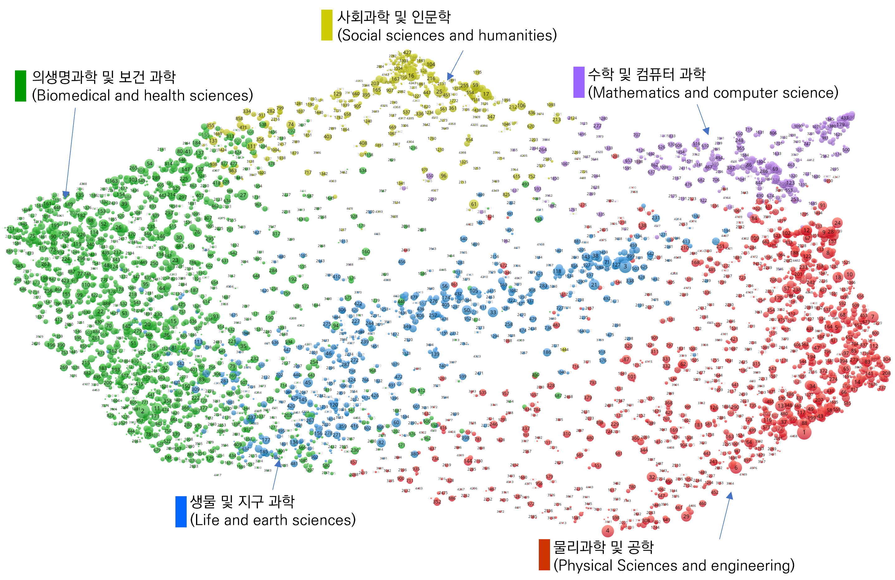
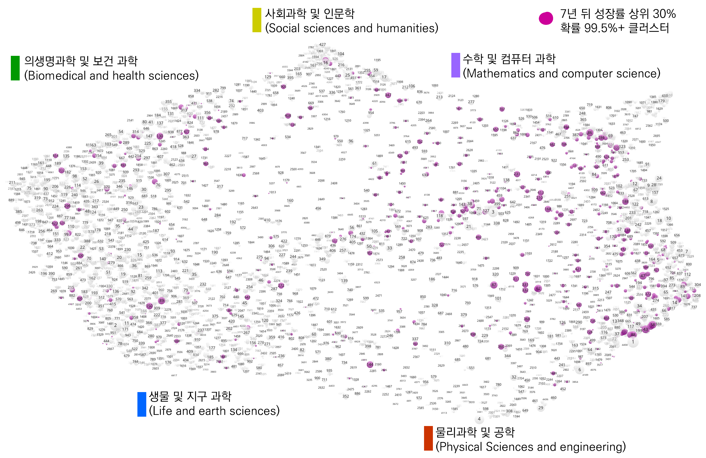
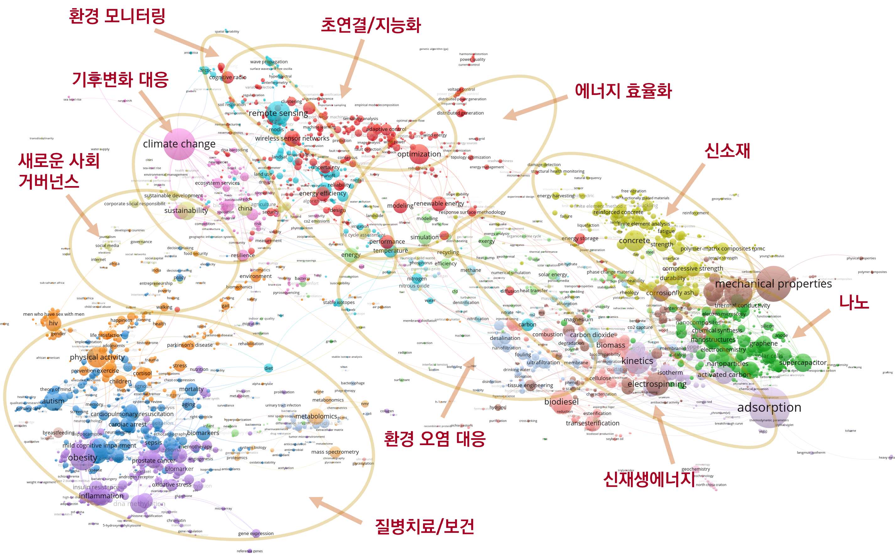

## Prediction growth

### 딥러닝을 이용한 기술클러스터의 미래 성장가능성 예측

#### Predicting the Future Growth Probability of Science and Technology Clusters using Deep Learning

> 이준영, 안세정, 김도현 (2019), KISTI Data Insight 제 11호 http://mirian.kisti.re.kr/index.jsp

 

본 연구는 글로벌 전체 논문 집합에서 생성된 [클러스터](https://www.leidenranking.com/information/fields)(micro-level field)들을 과학기술의 발전 추이를 추적하는 단위로 설정하였음. 세부 영역의 성장 예측을 위해 해당 영역이 상층(연구분야/분과학문)과 하층(구체화된 연구문제/주제)의 층위와 맞물려 형성되는 '구조' 관련정보를 벡터화(임베딩)하고, 이를 예측 모형의 입력변수로 활용하는 방식을 새롭게 제시하였음. 세부 연구 영역은 모티프 기법을 활용한 문서간 유사도 네트워크의 임베딩 벡터, 상층에서는 분류코드 정보를 활용한 연구분야 임베딩 벡터, 하층에서는 Google의 BERT 모형을 활용하여 문헌의 초록 텍스트 임베딩 벡터를 생성하고 이를 결합한 최적의 딥러닝 예측모형을 구성하였음.

 

**전체 클러스터의 지형도**

---
#### 공개 데이터
 

* [cluster_4535_map.txt](./data)
* [cluster_4535_network.zip](./data)
 

: 4535개 클러스터별로 소속된 문헌(2006-2017년)의 참고문헌에서 Web of Science 분류코드를 추출하여 인용프로파일 벡터를 생성한 뒤, 클러스터별 cosine 유사도를 계산한 결과임. 제공 데이터는 [VOSviewer](https://www.vosviewer.com)용으로 가공한 것임.   

 

* [predition_result.txt](./data)

: 각 개별 [클러스터 정보](https://www.leidenranking.com/Content/CWTS%20Leiden%20Ranking%202019%20-%20Micro-level%20fields.xlsx)에 예측결과로 산출된 성장가능성 확률(prob 필드), 전체 기간(2006-2017년), 클러스터의 논문수 증가율(slope, log_slope), 최근 5년(2013-2017년) 클러스터의 논문수 증가율(slope_5, log_slope_5) 정보를 추가하였음. 예측 목표 변수인 '성장가능성 확률'은 예측 시점 년도 이후 7년 뒤에 성장률이 상위 30% 이내의 고성장 군에 속할 확률을 의미함.   
 

**성장가능성 확률이 높게 예측된 클러스터 위치 표시**

 

* [keyword_cooccurence.txt](./data)

: 높은 성장가능성을 갖는 것으로 예측된 477개 기술클러스터에 속한 1,738,632건의 논문에 포함된 저자키워드 중에서 100회 이상 출현한 키워드 7,716개 중 동시출현(co-occurrence) 횟수 20회 이상인 4,758개 키워드 간의 동시출현 정보임.

 

**성장가능성 확률이 높게 예측된 기술클러스터의 주요 키워드 매핑**

